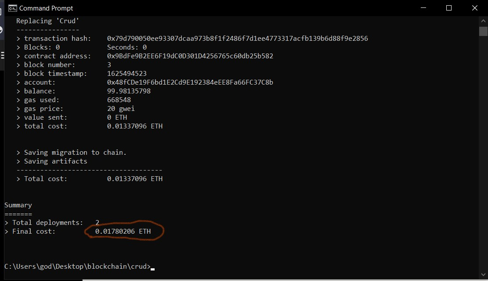
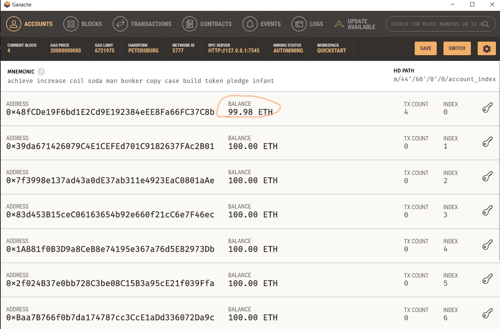
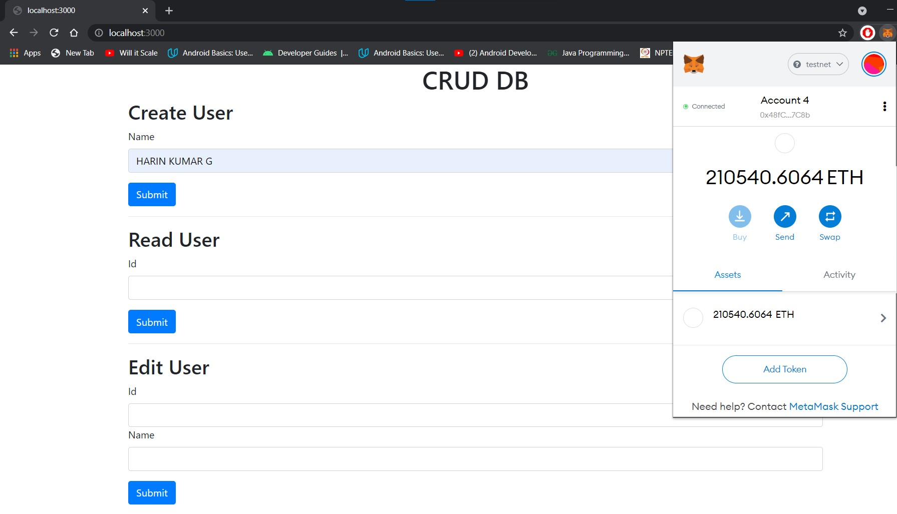
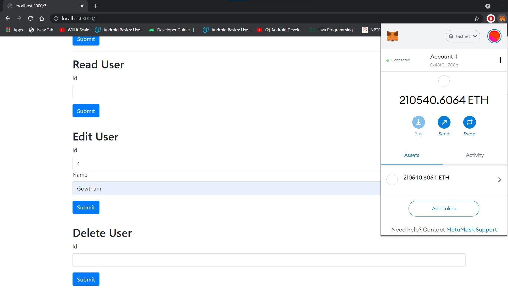
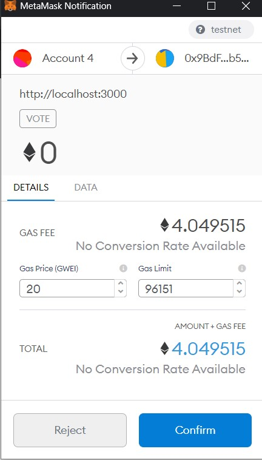

# Blockchain-Crud-Dapp
* CRUD stands for Create,Read,Update,Delete . 
* This is an application that performs CRUD operations on a local database on the Blockchain. 
* The front-end client is written using Bootstrap .The client will be connected to a local Ethereum blockchain . We’ll code all the logic about our dApp in a CRUD smart contract(crud.sol) with the Solidity programming language .Finally the smart contract will be deployed to our local Etherum blockchain and allow accounts that are connected to the metatmask to start performing operations.

## **🛠Tools and Dependencies** 
* Web3.js - enables client side app to talk to blockchain
* Metamask - enables browser to talk to blockchain and performs transaction.
* Ganache - local blockchain network.
* Remix - online smart contract IDE.
* Npm - package manager.
* Truffle - framework.

## **📖Instructions**

**1. Clone the project**

**2. Install node dependencies**
* $ npm install

**3. Start Ganache**
* Download link : <link>https://www.trufflesuite.com/ganache</link>
* Open the Ganache GUI client that you downloaded. This will start local blockchain instance.

**4. Compile , Migrate and Deploy Election Smart Contract**
* Use the command " $ truffle migrate " to compile and migrate the smart contract .
* Use the command " $ truffle migrate --reset " , when you restart the code compilation .Since we can't overwrite contracts in blockchain. 

**5. Login Metamask and configure**
* Unlock Metamask using the passphrase .
* Connect metamask to your local Etherum blockchain(Ganache) .
* Import an account provided by ganache to metamask .

**6. Start the Application**
* Command : $ npm run dev to start the applicatition .
* Sign in the transaction in metamask to complete the operation .

## **🖼Screenshots**
* Compile and migrate contract :

* Ganache connected with the contract :

* Operation "Create" :

* Operation "Edit" :

* Metamask Transaction confirmation :

